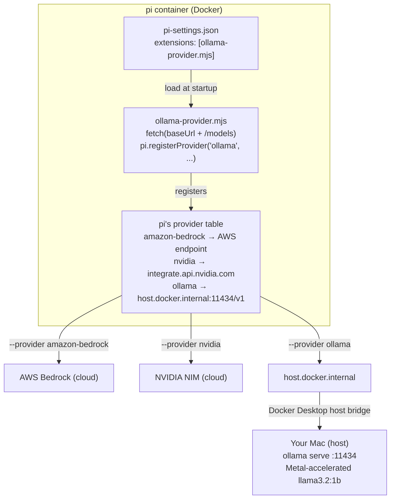
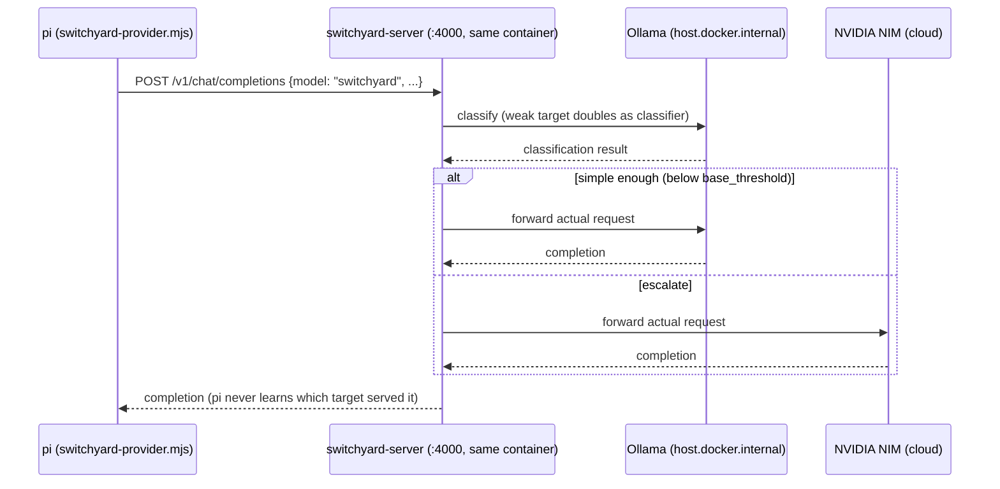
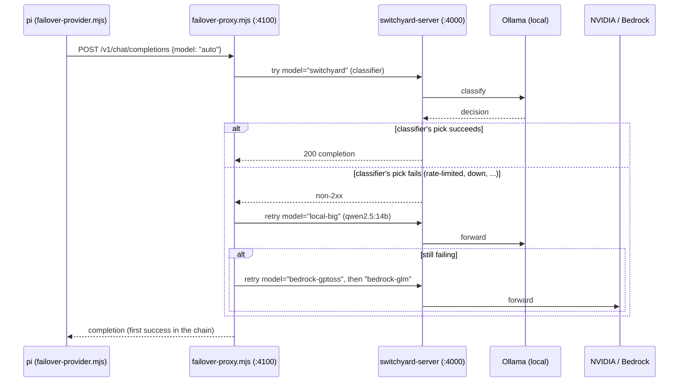
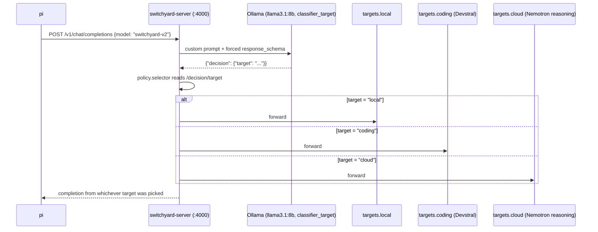

# pi Sandbox — Architecture Log

Versioned snapshots of this project's architecture. Each entry below is a checkpoint in
time: a brief description of the system state plus the diagram(s) that represent it.

**Maintainer note (to self, ongoing):** whenever a structural change lands (new provider,
new persistence mechanism, new integration like SwitchYard), append a new version below
rather than editing prior ones. Each entry gets: a version number, a date, a short
paragraph on what changed and why, and updated diagram(s). Keep prior versions intact —
this is a log, not a living single diagram — so the project's evolution stays legible.

---

## v1 — 2026-08-22 — Multi-provider pi (Bedrock + NVIDIA + local Ollama)

### Description
`pi` runs in a Docker container (`docker-compose.yml` + `Dockerfile`) with credentials for
Amazon Bedrock and NVIDIA NIM passed through as environment variables (backed by a
gitignored `.env`). Config (`pi-settings.json`) and installed packages are baked into the
image via `COPY`/`RUN pi install` for reproducibility, rather than relying on the
container's ephemeral runtime state. Session history is redirected out of the ephemeral
container filesystem into the bind-mounted project directory via `sessionDir`.

The newest piece: a locally-hosted model (Ollama, running natively on macOS to get Metal
GPU acceleration — Docker Desktop on Apple Silicon can't pass Metal through to a
containerized process) is wired in as a fully custom `pi` provider via the
`pi.registerProvider()` extension API. The extension (`pi-extensions/ollama-provider.mjs`)
does live model discovery against Ollama's OpenAI-compatible endpoint at container
startup, and is loaded automatically via `pi-settings.json`'s `extensions` array. From
`pi`'s perspective, Bedrock, NVIDIA, and Ollama are indistinguishable — each is just a
`baseUrl` + API shape + model list; `--provider X --model Y` is the only thing that
changes across all three.

### Diagram — request flow across providers



### Diagram — ASCII equivalent
```
┌─────────────────────── pi (inside Docker container) ────────────────────────┐
│                                                                              │
│  pi-settings.json                                                           │
│  { "extensions": ["/work/pi-extensions/ollama-provider.mjs"] }              │
│         │                                                                   │
│         │  "load and run this file at startup"                             │
│         ▼                                                                   │
│  ollama-provider.mjs                                                        │
│  ┌────────────────────────────────────────────┐                            │
│  │ fetch(baseUrl + "/models")   ← discovery    │                            │
│  │ pi.registerProvider("ollama", {             │                            │
│  │   baseUrl: "http://host.docker.internal     │                            │
│  │             :11434/v1",                     │                            │
│  │   api: "openai-completions",                │                            │
│  │   models: [ ...whatever Ollama reports ]    │                            │
│  │ })                                          │                            │
│  └────────────────────────────────────────────┘                            │
│         │  registers into ...                                              │
│         ▼                                                                   │
│  pi's internal provider table (all look identical to pi):                  │
│  ┌──────────────────────────────────────────────────────────────────────┐  │
│  │ amazon-bedrock → baseUrl: AWS Bedrock endpoint     (bearer token)    │  │
│  │ nvidia         → baseUrl: integrate.api.nvidia.com (API key)        │  │
│  │ ollama         → baseUrl: host.docker.internal:11434/v1 (no key)    │  │
│  └──────────────────────────────────────────────────────────────────────┘  │
│         │  --provider X --model Y  →  POST {baseUrl}/chat/completions      │
└─────────┼────────────────────────────────────────────────────────────────┘
          │
   ┌──────┼──────────────┬────────────────────────┐
   ▼                     ▼                        ▼
AWS Bedrock         NVIDIA NIM           host.docker.internal
 (cloud)              (cloud)                     │
                                                    │ Docker Desktop's
                                                    │ host network bridge
                                                    ▼
                                        ┌─────────────────────────┐
                                        │      Your Mac (host)     │
                                        │  ollama serve  :11434    │
                                        │  Metal-accelerated       │
                                        │  llama3.2:1b             │
                                        └─────────────────────────┘
```

### Known-good state at this version
- Bedrock + NVIDIA: authenticated, confirmed working.
- Ollama: `llama3.2:1b`, confirmed working end-to-end (`pi` → extension → Ollama → Metal).
- Session persistence: confirmed working via `pi --resume` (Current Folder scope shows
  full real history); the passive startup "Recent sessions" glance-panel has a cosmetic
  loading-race quirk, not a real data issue.
- Not yet done: SwitchYard router integration, full three-provider demo run back-to-back.

---

## v2 — 2026-08-22 — Container runtime switched: Docker Desktop → Colima

### Description
Deliberate infrastructure change, not a side effect of debugging: hit a **disk space issue
on the internal/root volume**, traced to Docker Desktop (its VM backing store lives on the
boot disk by default, regardless of where projects/images actually point). In a prior,
separate session, migrated the container runtime to **Colima** (Lima-VM-based) — lower
overhead, and its VM/data directory can be pointed anywhere via `COLIMA_HOME` (here,
`/Volumes/T7/Colima`, off the root volume entirely) — and removed Docker Desktop. Everything
from v1 (the multi-provider `pi` setup, the diagrams, the provider abstraction) is
unchanged — this entry only concerns the layer underneath `docker compose`.

Note: a stray old `Docker.app` copy was still found at `/Volumes/T7/DEV/docker/` during
this session's troubleshooting, left over from that migration — worth a cleanup pass if
it's not meant to still be there.

The switch surfaced several gaps that had been silently papered over by Docker Desktop's
GUI app self-managing things, worth recording since they're exactly the kind of "worked by
accident" issues that bite later:

- **CLI plugin resolution.** Docker Desktop manages `~/.docker/cli-plugins/` (symlinks into
  its own app bundle) and self-heals them on launch. Colima doesn't run a GUI app to do
  this — `docker-compose` and `docker-buildx` need to be installed as their own Homebrew
  formulae, plus `cliPluginsExtraDirs` added to `~/.docker/config.json` pointing at
  Homebrew's plugin directory so the `docker` CLI knows to look there.
- **Credential helper.** `~/.docker/config.json`'s `credsStore` defaulted to `"desktop"`
  (a Docker-Desktop-only binary). Switched to `"osxkeychain"` (via
  `brew install docker-credential-helper`).
- **Docker context / socket path.** Colima manages its own `docker context` named
  `colima`; if that context's endpoint drifts from where the running instance actually put
  its socket (e.g. after manually creating a new instance without the right home
  directory), everything fails with generic-looking connection errors.
- **The real one — VM mount scope.** Lima VMs only mount `$HOME` (and a couple of default
  paths) into themselves by default. A project living outside `$HOME` (here, on an
  external SSD at `/Volumes/T7`) gets a **silently empty bind mount** inside every
  container — `docker compose run` succeeds, `/work` exists, but it's empty. No error,
  just nothing there. Fixed with `colima start --mount /Volumes/T7:w`, which persists in
  Colima's saved config for future starts.

`host.docker.internal` (used by the Ollama extension to reach the host) continued to work
identically under Colima — that resolution mechanism isn't Docker-Desktop-specific.

### Known-good state at this version
- Colima running with `/Volumes/T7` mounted (writable), `COLIMA_HOME=/Volumes/T7/Colima`
  (already set in `.zshrc`).
- `docker compose build`/`run` confirmed working from `pi-multi-provider/` on Colima.
- Full end-to-end re-verified post-switch: `fd`/`rg` present, `ollama` extension loads,
  both local models register, real completion via `pi --provider ollama --model
  llama3.2:1b` returns actual output.

---

## v3 — 2026-08-25 — SwitchYard request routing + Prometheus/Grafana observability

### Description
`model-router/` (previously just a copy of the multi-provider setup with `switchyard-server`
built into the image, unconfigured) now actually routes. `pi`'s only upstream is
`switchyard-server`, itself running inside the same container, driven by a bind-mounted
`routes.toml`: an `llm_classifier` route (`smart`/`switchyard`) fires a cheap classification
call against the local Ollama model to decide, per request, whether to answer on local Ollama
(`weak_target`) or escalate to cloud NVIDIA NIM (`strong_target`). Two `passthrough` routes
(`local`, `cloud`) exist alongside it to force one side manually. A new `pi` extension,
`switchyard-provider.mjs`, registers Switchyard's own routes as a `pi` provider (mirroring the
existing `ollama-provider.mjs` pattern) — from `pi`'s perspective it makes one call to one
model, `switchyard`; it never talks to NVIDIA or Ollama directly, and never learns which one
actually served the request.

**Amazon Bedrock is deliberately not part of this router.** Its wire protocol
(`bedrock-converse-stream`: SigV4/bearer auth, a `/model/{id}/converse-stream` path —
confirmed by inspecting `pi`'s own bundled `amazon-bedrock.json` provider catalog) isn't one
of Switchyard's three supported `llm_client` formats (`openai_chat` / `openai_responses` /
`anthropic_messages`). Bedrock stays available as `pi`'s plain built-in provider, outside the
router — drift that's intentional, not a gap to close.

Observability: `switchyard-server` runs with `RUST_LOG=switchyard_server=debug,libsy=debug`
and `--routing-log-file`, giving a debug trace plus one clean JSON record per routed
request (model, tier, token counts) in `switchyard-routing.jsonl` — both bind-mounted into
`/work`, readable from the host. On top of that, `prometheus` and `grafana` were added as two
more services in the same `docker-compose.yml`, scraping `switchyard-server`'s own
`/metrics` (Prometheus text from its OpenTelemetry provider — `switchyard_llm_calls_total`,
latency histograms, etc.). Grafana is fully pre-provisioned (anonymous Admin access, a
`Prometheus` datasource, and a `switchyard-routing` dashboard all load automatically) — no
manual setup step, just open `http://localhost:3000`.

**A real bug found and fixed along the way:** `switchyard-server` failed to start against
*any* config (`invalid server config: upstream transport error: builder error`) — even a
config with only a plain-`http://` Ollama client, no NVIDIA/TLS involved at all. Root cause:
`node:22-slim` doesn't ship the `ca-certificates` package, and `switchyard-server`'s HTTP
client (`reqwest` + `rustls-platform-verifier`) needs a valid system root store to construct
its one shared client at startup, regardless of whether any individual target uses TLS.
`awscli`'s own bundled CA bundle had silently masked this gap in every prior Dockerfile in
this project — added `ca-certificates` to `model-router/Dockerfile`'s apt install line.

### Diagram — request flow through the router


### Known-good state at this version
- `switchyard-server` starts cleanly, all three routes (`switchyard`, `local`, `cloud`) list
  via `GET /v1/models`; `GET /health` returns `{"status":"ok"}`.
- Real end-to-end call confirmed via `pi -p "..."`: routing decision logged to both
  `.switchyard.log` (DEBUG trace) and `switchyard-routing.jsonl` (structured record), request
  actually reached the selected upstream (both NVIDIA and Ollama legs individually confirmed).
- `prometheus` confirmed scraping `pi:4000/metrics` (target `health: up` via
  `/api/v1/targets`); `grafana` dashboard loads pre-provisioned with no manual setup.
- **Resolved:** `llama3.2:1b` (the original `weak`/local target and classifier) was not
  reliably strong enough to handle `pi`'s actual system-prompt weight. Observed directly,
  twice, with different trivial prompts: "say hi" and "what is the capital of France"
  (prompt weight ~2050 tokens once `pi`'s full tool schema is included) both routed to local
  and produced long, incoherent rambling about an unrelated "watchdog object" schema —
  clearly latching onto fragments of its own context instead of answering. The *routing*
  worked exactly as configured throughout (classifier called, decision logged, correct
  target dialed); the *local model* was the weak link. Swapped `targets.local` in
  `routes.toml` to `llama3.1:8b` (already pulled on the host from earlier work, no download
  needed) — both prompts re-run afterward, one stayed local and one escalated to cloud, both
  produced correct, coherent answers. **Real tradeoff, not free:** the 8B model is
  meaningfully slower — the local "capital of France" answer took 18.2s total end-to-end vs.
  ~7.5s with the 1B model, since the classifier call and the served call both now run on the
  bigger model in sequence. Worth it for correctness; worth calling out honestly for the
  write-up.
- `render-trace.mjs` added: reads `switchyard-routing.jsonl` + `.switchyard.log` live and
  regenerates a self-contained `trace.html` (no external libraries, no network calls) showing
  the actual hop-by-hop path of whichever request ran most recently — reproducible by anyone
  following along, not tied to any hosted link. Building it surfaced one more real bug:
  `entrypoint.sh` was truncating `.switchyard.log` (`>`) on every container restart while
  `--routing-log-file` kept appending, silently desyncing the two files. Fixed to `>>`.
- **Tried and abandoned:** wired a `tempo` service and pointed
  `OTEL_EXPORTER_OTLP_ENDPOINT` at it, hoping `switchyard-server`'s bundled
  `opentelemetry-otlp` dependency meant it exported real distributed traces. Confirmed
  empirically it does not — zero spans arrived after a real request, no errors either. That
  dependency is almost certainly only feeding the Prometheus metrics side. Removed the
  `tempo` service, its datasource, and `tempo.yaml` entirely rather than keep dead weight in
  the stack.

---

## v4 — 2026-08-27 — Availability failover chain + live trace viewer (PR #17)

### Description
Two gaps closed, both driven by the same underlying fact: **`switchyard-server` has no
concept of retrying a different provider on failure.** Its classifier (`routes.smart`)
picks a target once, *before* the call, based on task complexity — not on whether that
target is actually reachable. Confirmed directly against the schema and the standalone
binary's own docs: no `fallback`, `on_error`, or ordered-target field exists anywhere. (A
related NVIDIA product, NeMo Relay, *does* add exactly this — it uses Switchyard for the
routing decision but layers its own dispatch/retry/trusted-fallback on top. That's not what
we're running here.)

**`failover-proxy.mjs`** is the layer that fills that gap — a small always-running Node HTTP
server, started once from `entrypoint.sh` alongside `switchyard-server`, that pi now talks
to by default (port 4100) instead of `switchyard-server` directly (port 4000, still reachable
for manual testing). It tries Switchyard's own classifier-driven route first; only on a
non-2xx response or network error does it retry the *same* request against a different
Switchyard route — asking Switchyard for a different target, not calling providers directly
itself. That matters: every attempt, including the failed ones, still gets logged by
Switchyard exactly like any other request, so the existing routing log, debug trace,
Grafana dashboard, and trace viewer all see fallback activity for free, with zero changes to
any of them.

The chain, cheapest/freest first: `switchyard` (the classifier's own nvidia/ollama pick) →
`local-big` (`qwen2.5:14b`, a noticeably bigger local model — still $0, just slower, worth
trying before spending anything) → `bedrock-gptoss` (`openai.gpt-oss-20b-1:0`, `$0.07/$0.3`
per 1M tokens) → `bedrock-glm` (`zai.glm-5`, `$1/$3.2`). Verified the cascade logic itself
works, not just individually-working rungs: temporarily put a nonexistent model first in the
chain, confirmed a real 404 followed by real fallthrough to `switchyard`, logged in
`failover.jsonl`, then reverted.

**Real findings wiring Bedrock in as fallback targets** (each confirmed empirically, not
assumed from docs):
- **Amazon's own Nova models are not reachable through Switchyard at all.** They don't
  appear in Bedrock's OpenAI-compatible model catalog on either `bedrock-runtime` or
  `bedrock-mantle` — those surfaces only expose *third-party* models hosted on Bedrock
  (Anthropic, Google, Mistral, Qwen, OpenAI's own `gpt-oss`, etc.), not Amazon's first-party
  line. Nova is only reachable via Bedrock's native Converse API, the same wire protocol
  already established as out of reach for Switchyard. Not a config gap — a real product
  limitation.
- **Claude models need `format = "anthropic_messages"`, not `openai_chat`** — confirmed via
  AWS's own error text (`"does not support the '/v1/chat/completions' API"`). Correct
  connection details (verified structurally, via a clean `permission_error` rather than a
  protocol error): `POST https://bedrock-runtime.{region}.amazonaws.com/anthropic/v1/messages`,
  header `x-api-key` (not `Authorization: Bearer`), `anthropic-version: 2023-06-01`, model
  `us.anthropic.claude-sonnet-5`. Not wired in as a live target: this AWS account doesn't
  have Bedrock model access granted for Claude yet — a one-time console step, not a config
  problem. Documented rather than guessed further once the real blocker was identified.
- `openai.gpt-oss-20b-1:0` and `zai.glm-5` (both open-weight-friendly, no Bedrock
  model-access gate) confirmed working immediately via the same `openai_chat` client already
  used for NVIDIA.

**`trace-server.mjs`** replaces the one-shot `render-trace.mjs` from v3. The old script had
to be re-run manually and only ever showed the *most recent* request — not what "run a
session, then go back and look at the hops" actually needs. The new one is an
always-running server (same pattern as `failover-proxy.mjs`: started once, left running),
reconstructing full request history from `switchyard-routing.jsonl` + `.switchyard.log` on
every page load. `http://localhost:4321/` lists every request seen so far, newest first,
auto-refreshing; each one's detail page now renders an actual Mermaid `sequenceDiagram` —
participants, arrows, the routing-decision note — above the existing hop ledger, rendered
client-side from the real `mermaid` npm package's browser bundle (baked into the image at
`/opt/mermaid`, served locally at `/static/mermaid.min.js`; no CDN, no headless-browser
dependency just to draw one diagram).

### Diagram — request flow with failover


### Known-good state at this version
- All four chain rungs (`switchyard`, `local-big`, `bedrock-gptoss`, `bedrock-glm`)
  confirmed working individually, through Switchyard, with real responses.
- Cascade logic itself proven (not just the individual rungs) via a deliberate injected
  failure, logged in `failover.jsonl`.
- `trace-server.mjs` confirmed serving live history at `:4321`, including a real rendered
  Mermaid diagram per request.
- Merged via PR #17 (`worktree-switchyard-routing` → `master`). One notable non-technical
  wrinkle: the PR's original CI check suite got permanently orphaned by a live GitHub Actions
  platform outage (confirmed via githubstatus.com, not assumed) mid-review — it never
  completed and couldn't be cancelled through any API. Fix was the standard one for an
  outage-orphaned check suite: push a fresh commit, which gets its own clean check suite tied
  properly to the PR, rather than fighting the wedged one.
- **Deliberately deferred, not broken:** OpenAI direct (`openai-gpt51` target, needs a real
  `OPENAI_API_KEY`) and Claude on Bedrock (needs the model-access grant above) — both would
  be small, mechanical additions once their respective prerequisites are met.

## v5 — 2026-08-30 — Task-type-aware routing: a real 3-way classifier (`routes.smart-v2`)

`routes.smart` (v3) only ever does one thing: is this task easy enough for the weak model,
or does it need to escalate to the strong one? That's a real dynamic decision — but it's
binary, and it's about *capability tier*, not *task type*. The actual ask this version
answers: can Switchyard read a prompt and route a coding request to a coding-specialized
model, a deep-reasoning request to a reasoning-specialized model, and everything else to a
cheap local model — three genuinely different backends chosen by content, not just two tiers
of the same kind of judgment?

**Yes — `llm_classifier`'s `mode = "custom"` is the mechanism, and it's a materially
different schema from `mode = "capability"`:**

| | `capability` (v3's `routes.smart`) | `custom` (`routes.smart-v2`) |
|---|---|---|
| targets | exactly two: `weak_target` / `strong_target` | a `targets` list, any size ≥ 2 |
| judge's job | estimate `p_solve` (can the weak model do this?) | free-form: whatever your `prompt` asks it to decide |
| judge's output | packaged verdict schema (`p_solve`, `capability_boundary`, ...) | your own `response_schema` — any structure |
| how a target gets picked | deterministic threshold math on `p_solve` | `policy.selector`, a JSON Pointer (e.g. `/decision/target`) read out of the judge's verdict |
| unusable verdict | falls back to `strong_target` | falls back to `default_target` |

Confirmed against Switchyard's own docs before writing any config (`docs/routing_algorithms/llm_classifier_routing.md`), not guessed from the summarized capability-mode example — the actual field is `policy.selector` under `type = "target_selector"`, not a flat `target_selector` key as an early pass at this assumed.

`routes.smart-v2` (`routes.toml`): same judge as before (`classifier_target = "local"`,
reusing the free Ollama model — no new cost to classify), `targets = ["local", "coding",
"cloud"]`, a custom `prompt` describing the three categories, a `response_schema` forcing
`{"decision": {"target": "..."}}`, and `policy.selector = "/decision/target"`. `routes.smart`
(v3) is untouched and still live — the two coexist for direct A/B comparison.

**Real findings picking the `coding` target** (each confirmed by curling the provider
directly, not assumed from a catalog listing):
- Every dedicated code model in NVIDIA's own `/v1/models` catalog for this account turned
  out to be dead weight. `qwen/qwen2.5-coder-32b-instruct` is a hard `410 Gone` — NVIDIA
  retired it 2026-05-12. `codestral`, `codellama`, `codegemma`, `granite-code`, `starcoder2`,
  and `deepseek-coder` all `404` with `"Function ... Not found for account"` — listed in the
  catalog, never actually deployed for this key. A real product gap, the same class of
  finding as v4's Nova/Claude blockers, just on NVIDIA's side this time.
- Checked Bedrock's catalog next, same account, no new key needed — and it actually has
  dedicated coders: `mistral.devstral-2-123b` (Devstral, purpose-built for
  software-engineering tasks) and `qwen.qwen3-coder-next` both return real `200`s on
  `bedrock-runtime`. Devstral produces genuinely correct, well-explained code on a real
  prompt (reversing a linked list) — wired in as `targets.coding`. (Two of Bedrock's other
  listed Qwen-coder variants, `-30b` and `-480b`, reject as invalid model IDs on
  `bedrock-runtime` — the same class of quirk as `gpt-oss`'s `-1:0` suffix requirement in
  v4, not chased further since two working coders was already enough.)
- Re-tested Claude on Bedrock while here, since its catalog listing has grown since v4
  (`claude-sonnet-5`, `claude-opus-5`, `claude-opus-4-7/4-8`, `claude-haiku-4-5` all now
  appear). Still the identical `permission_error` on `claude-sonnet-5` — a bigger catalog
  listing isn't evidence of account access; the actual blocker (the console model-access
  grant from v4) is unchanged. Also confirmed: no Sonnet 4.x exists in this catalog at all,
  only Haiku and Opus in that generation.
- One config bug caught by `--dry-run` before it became a live bug: giving the `cloud`-tier
  target a second name (`targets.reasoning`, same model id as `targets.cloud`) for readability
  triggered a real warning — `switchyard-server` silently drops one of two targets that share
  a model id + client pair. Fixed by having `routes.smart-v2` reference `targets.cloud`
  directly instead of duplicating it.

**Test cases, three prompts, one per target** — validated two ways, deliberately: a scripted
test (`tests/test-custom-routing.sh`, checks the actual served `model` field against what
each target should resolve to, `tests/README.md` covers what it does and doesn't prove) and
a manual side-by-side curl walkthrough hitting the same live stack. Both agreed on all three:

| Prompt | Classified as | Model served |
|---|---|---|
| "say hello in exactly 3 words" | `local` | `llama3.1:8b` (Ollama) |
| Reverse a linked list, explain the pointers | `coding` | `mistral.devstral-2-123b` (Bedrock) |
| Prove infinitude of primes, discuss Euclid's proof historically | `cloud` | `nvidia/nemotron-3-nano-omni-30b-a3b-reasoning` (NVIDIA NIM) |

### Diagram — task-type classification


### Known-good state at this version
- `routes.smart-v2` confirmed genuinely content-aware: three distinct prompts land on three
  distinct, correctly-specialized backends, verified via both a scripted test and an
  independent manual run against the same live stack, in full agreement.
- `routes.smart` (v3, capability mode) untouched and still live alongside it.
- Dockerfile gained `jq` (missing from the image since v3, discovered mid-session while
  trying to read a JSON response by hand).
- **Deliberately deferred, not broken:** Claude on Bedrock — same account-level
  model-access-grant blocker as v4, re-confirmed rather than assumed stale. A genuinely
  bigger/better `coding` model is also on the table if real `OPENAI_API_KEY` /
  `ANTHROPIC_API_KEY` values get added later (direct clients, bypassing Bedrock's access-grant
  question entirely) — not pursued this round since Devstral already closed the gap without
  new keys.

## v6 — 2026-09-01 — Manual-switch vision route (screenshot/image analysis)

Every route so far — `routes.smart`, `routes.smart-v2`, the passthrough routes — only ever
handles text. Pasting a screenshot into `pi` silently went nowhere: the request would forward
to whichever text model was selected and either get ignored or upstream-error, depending on
the model. The ask this version answers: give `pi` a model you can manually switch to that
actually reads images, without asking the classifier to guess at it.

**Deliberately not wired into `routes.smart-v2`.** None of the existing targets or the
smart-v2 judge were ever checked against image input — teaching the classifier to route images
too would mean re-validating the judge's behavior on multimodal content, a bigger change than
this ask needed. Instead: `targets.vision` + a plain `routes.vision` passthrough, same shape as
`routes.local`/`routes.cloud`, picked explicitly by name.

**Two-part fix, not just config** — the config half alone would have shipped a route `pi`
still couldn't use:
1. `routes.toml`: `targets.vision` → `meta/llama-3.2-11b-vision-instruct` (NVIDIA NIM, same
   `nvidia` client and `NVIDIA_API_KEY` every other NVIDIA target already uses — no new key),
   plus `routes.vision` as a plain passthrough.
2. `pi-extensions/switchyard-provider.mjs` hardcoded `input: ["text"]` on every route it
   registered with `pi`, regardless of what the underlying model actually supports. Even with
   the route correctly wired in `routes.toml`, `pi` itself wouldn't offer to attach an image to
   *any* Switchyard model until this was fixed — this, not `routes.toml`, was the real reason
   images "didn't work." Fixed with an `IMAGE_CAPABLE_ROUTE_IDS` set, currently just `{"vision"}`.

**Catalog check, same pattern as v5's coding-model hunt** — confirmed by curling NVIDIA
directly, not assumed from the listing: `meta/llama-3.2-11b-vision-instruct` and
`-90b-vision-instruct` are genuinely deployed (`200`, correctly read a real test image).
`microsoft/phi-3-vision-128k-instruct`, `nvidia/vila`, and `nvidia/neva-22b` — all also listed
in NVIDIA's `/v1/models` — are phantom listings, `404 "Function ... Not found for account"`.
Picked 11b over 90b: already fully verified this round; 90b is untested but on the table later
if 11b proves too coarse on dense screenshots.

**Real upstream gotcha, not a config bug**: calling `routes.vision` from a normal `pi` session
(tools enabled, full tool-schema system prompt) fails with:

```
The number of image tokens (0) must be the same as the number of images (1)
```

NVIDIA's vLLM-hosted Llama-3.2-Vision (mllama architecture) miscounts image placeholder tokens
once pi's large tool-schema system prompt is in the request. Confirmed by isolating the
variable: the exact same image succeeds via plain curl through Switchyard (no tools involved)
and fails only when sent through `pi` with tools enabled. `--no-tools` shrinks the system
prompt enough to avoid it — and you don't need tools to describe an image anyway:

```bash
pi --no-tools --provider switchyard --model vision -p "describe this" @screenshot.png
```

**Tested two ways** (`tests/test-vision-route.sh`, `tests/README.md`): a direct curl through
Switchyard's passthrough (proves the route/target wiring), and the actual `pi --no-tools` path
(proves the real user-facing workaround still works, not just raw HTTP). Both generate a small
solid-red PNG in-script and check the model correctly names the color:

| Check | Path | Result |
|---|---|---|
| curl direct | `POST /v1/chat/completions {model: "vision"}` | `meta/llama-3.2-11b-vision-instruct` correctly answered "Red." |
| `pi --no-tools` | `pi --no-tools --provider switchyard --model vision -p "..." @image.png` | correctly answered "Red." |

### Known-good state at this version
- `routes.vision` confirmed genuinely image-capable, both via raw HTTP and via `pi` itself,
  with the `--no-tools` workaround for the upstream mllama/vLLM quirk documented and tested.
- Every prior route (`routes.smart`, `routes.smart-v2`, passthroughs) untouched and still live.
- `switchyard-provider.mjs`'s `input` field is now per-route-accurate instead of a blanket
  `["text"]` — a latent bug (nothing could ever have used image input through `pi`, even a
  correctly-configured vision target) fixed as a side effect of this change.
- **Deliberately deferred, not broken:** `meta/llama-3.2-90b-vision-instruct` as a second,
  more-capable vision option — real and confirmed listed, just not exercised this round since
  11b already closed the gap. Also deferred: tools + vision in the same call — `--no-tools` is
  a real workaround for "describe an image," not a fix for a hypothetical "read this screenshot
  and then edit a file based on it" flow, which would need pi's tool-schema prompt trimmed some
  other way if it ever comes up.
