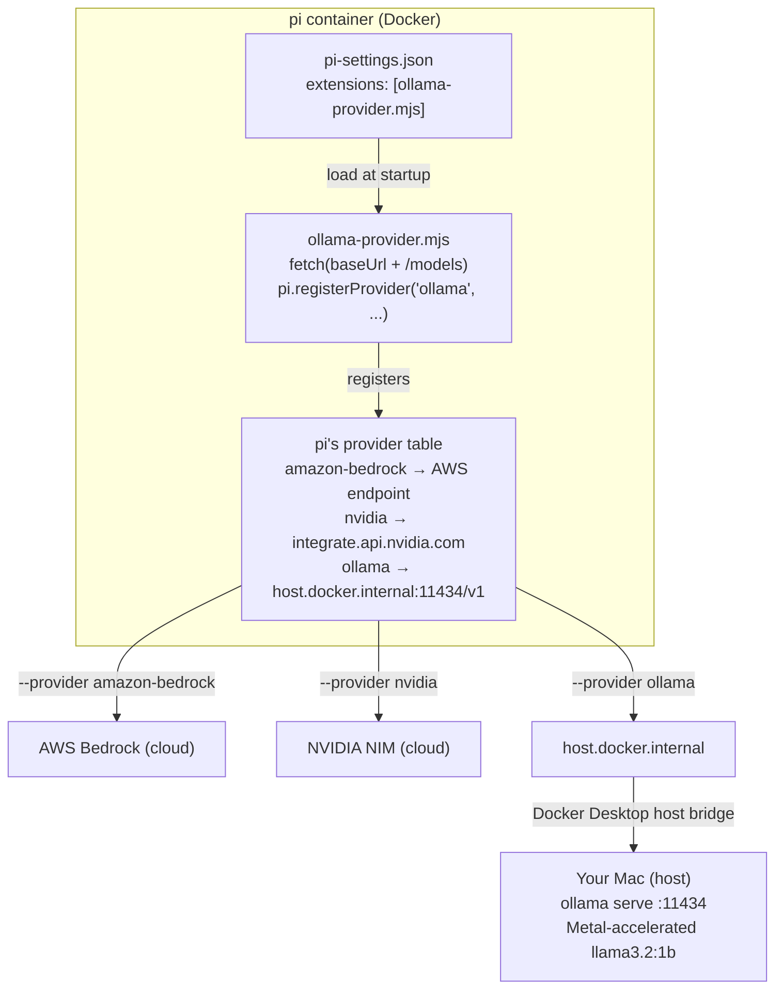
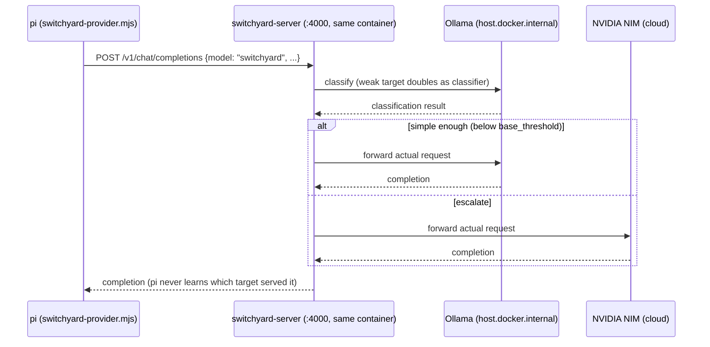

# pi Sandbox — Architecture Log

Versioned snapshots of this project's architecture. Each entry below is a checkpoint in
time: a brief description of the system state plus the diagram(s) that represent it.

**Maintainer note (to self, ongoing):** whenever a structural change lands (new provider,
new persistence mechanism, new integration like SwitchYard), append a new version below
rather than editing prior ones. Each entry gets: a version number, a date, a short
paragraph on what changed and why, and updated diagram(s). Keep prior versions intact —
this is a log, not a living single diagram — so the project's evolution stays legible.

---

## v1 — 2026-08-22 — Multi-provider pi (Bedrock + NVIDIA + local Ollama)

### Description
`pi` runs in a Docker container (`docker-compose.yml` + `Dockerfile`) with credentials for
Amazon Bedrock and NVIDIA NIM passed through as environment variables (backed by a
gitignored `.env`). Config (`pi-settings.json`) and installed packages are baked into the
image via `COPY`/`RUN pi install` for reproducibility, rather than relying on the
container's ephemeral runtime state. Session history is redirected out of the ephemeral
container filesystem into the bind-mounted project directory via `sessionDir`.

The newest piece: a locally-hosted model (Ollama, running natively on macOS to get Metal
GPU acceleration — Docker Desktop on Apple Silicon can't pass Metal through to a
containerized process) is wired in as a fully custom `pi` provider via the
`pi.registerProvider()` extension API. The extension (`pi-extensions/ollama-provider.mjs`)
does live model discovery against Ollama's OpenAI-compatible endpoint at container
startup, and is loaded automatically via `pi-settings.json`'s `extensions` array. From
`pi`'s perspective, Bedrock, NVIDIA, and Ollama are indistinguishable — each is just a
`baseUrl` + API shape + model list; `--provider X --model Y` is the only thing that
changes across all three.

### Diagram — request flow across providers



### Diagram — ASCII equivalent
```
┌─────────────────────── pi (inside Docker container) ────────────────────────┐
│                                                                              │
│  pi-settings.json                                                           │
│  { "extensions": ["/work/pi-extensions/ollama-provider.mjs"] }              │
│         │                                                                   │
│         │  "load and run this file at startup"                             │
│         ▼                                                                   │
│  ollama-provider.mjs                                                        │
│  ┌────────────────────────────────────────────┐                            │
│  │ fetch(baseUrl + "/models")   ← discovery    │                            │
│  │ pi.registerProvider("ollama", {             │                            │
│  │   baseUrl: "http://host.docker.internal     │                            │
│  │             :11434/v1",                     │                            │
│  │   api: "openai-completions",                │                            │
│  │   models: [ ...whatever Ollama reports ]    │                            │
│  │ })                                          │                            │
│  └────────────────────────────────────────────┘                            │
│         │  registers into ...                                              │
│         ▼                                                                   │
│  pi's internal provider table (all look identical to pi):                  │
│  ┌──────────────────────────────────────────────────────────────────────┐  │
│  │ amazon-bedrock → baseUrl: AWS Bedrock endpoint     (bearer token)    │  │
│  │ nvidia         → baseUrl: integrate.api.nvidia.com (API key)        │  │
│  │ ollama         → baseUrl: host.docker.internal:11434/v1 (no key)    │  │
│  └──────────────────────────────────────────────────────────────────────┘  │
│         │  --provider X --model Y  →  POST {baseUrl}/chat/completions      │
└─────────┼────────────────────────────────────────────────────────────────┘
          │
   ┌──────┼──────────────┬────────────────────────┐
   ▼                     ▼                        ▼
AWS Bedrock         NVIDIA NIM           host.docker.internal
 (cloud)              (cloud)                     │
                                                    │ Docker Desktop's
                                                    │ host network bridge
                                                    ▼
                                        ┌─────────────────────────┐
                                        │      Your Mac (host)     │
                                        │  ollama serve  :11434    │
                                        │  Metal-accelerated       │
                                        │  llama3.2:1b             │
                                        └─────────────────────────┘
```

### Known-good state at this version
- Bedrock + NVIDIA: authenticated, confirmed working.
- Ollama: `llama3.2:1b`, confirmed working end-to-end (`pi` → extension → Ollama → Metal).
- Session persistence: confirmed working via `pi --resume` (Current Folder scope shows
  full real history); the passive startup "Recent sessions" glance-panel has a cosmetic
  loading-race quirk, not a real data issue.
- Not yet done: SwitchYard router integration, full three-provider demo run back-to-back.

---

## v2 — 2026-08-22 — Container runtime switched: Docker Desktop → Colima

### Description
Deliberate infrastructure change, not a side effect of debugging: hit a **disk space issue
on the internal/root volume**, traced to Docker Desktop (its VM backing store lives on the
boot disk by default, regardless of where projects/images actually point). In a prior,
separate session, migrated the container runtime to **Colima** (Lima-VM-based) — lower
overhead, and its VM/data directory can be pointed anywhere via `COLIMA_HOME` (here,
`/Volumes/T7/Colima`, off the root volume entirely) — and removed Docker Desktop. Everything
from v1 (the multi-provider `pi` setup, the diagrams, the provider abstraction) is
unchanged — this entry only concerns the layer underneath `docker compose`.

Note: a stray old `Docker.app` copy was still found at `/Volumes/T7/DEV/docker/` during
this session's troubleshooting, left over from that migration — worth a cleanup pass if
it's not meant to still be there.

The switch surfaced several gaps that had been silently papered over by Docker Desktop's
GUI app self-managing things, worth recording since they're exactly the kind of "worked by
accident" issues that bite later:

- **CLI plugin resolution.** Docker Desktop manages `~/.docker/cli-plugins/` (symlinks into
  its own app bundle) and self-heals them on launch. Colima doesn't run a GUI app to do
  this — `docker-compose` and `docker-buildx` need to be installed as their own Homebrew
  formulae, plus `cliPluginsExtraDirs` added to `~/.docker/config.json` pointing at
  Homebrew's plugin directory so the `docker` CLI knows to look there.
- **Credential helper.** `~/.docker/config.json`'s `credsStore` defaulted to `"desktop"`
  (a Docker-Desktop-only binary). Switched to `"osxkeychain"` (via
  `brew install docker-credential-helper`).
- **Docker context / socket path.** Colima manages its own `docker context` named
  `colima`; if that context's endpoint drifts from where the running instance actually put
  its socket (e.g. after manually creating a new instance without the right home
  directory), everything fails with generic-looking connection errors.
- **The real one — VM mount scope.** Lima VMs only mount `$HOME` (and a couple of default
  paths) into themselves by default. A project living outside `$HOME` (here, on an
  external SSD at `/Volumes/T7`) gets a **silently empty bind mount** inside every
  container — `docker compose run` succeeds, `/work` exists, but it's empty. No error,
  just nothing there. Fixed with `colima start --mount /Volumes/T7:w`, which persists in
  Colima's saved config for future starts.

`host.docker.internal` (used by the Ollama extension to reach the host) continued to work
identically under Colima — that resolution mechanism isn't Docker-Desktop-specific.

### Known-good state at this version
- Colima running with `/Volumes/T7` mounted (writable), `COLIMA_HOME=/Volumes/T7/Colima`
  (already set in `.zshrc`).
- `docker compose build`/`run` confirmed working from `pi-multi-provider/` on Colima.
- Full end-to-end re-verified post-switch: `fd`/`rg` present, `ollama` extension loads,
  both local models register, real completion via `pi --provider ollama --model
  llama3.2:1b` returns actual output.

---

## v3 — 2026-08-25 — SwitchYard request routing + Prometheus/Grafana observability

### Description
`model-router/` (previously just a copy of the multi-provider setup with `switchyard-server`
built into the image, unconfigured) now actually routes. `pi`'s only upstream is
`switchyard-server`, itself running inside the same container, driven by a bind-mounted
`routes.toml`: an `llm_classifier` route (`smart`/`switchyard`) fires a cheap classification
call against the local Ollama model to decide, per request, whether to answer on local Ollama
(`weak_target`) or escalate to cloud NVIDIA NIM (`strong_target`). Two `passthrough` routes
(`local`, `cloud`) exist alongside it to force one side manually. A new `pi` extension,
`switchyard-provider.mjs`, registers Switchyard's own routes as a `pi` provider (mirroring the
existing `ollama-provider.mjs` pattern) — from `pi`'s perspective it makes one call to one
model, `switchyard`; it never talks to NVIDIA or Ollama directly, and never learns which one
actually served the request.

**Amazon Bedrock is deliberately not part of this router.** Its wire protocol
(`bedrock-converse-stream`: SigV4/bearer auth, a `/model/{id}/converse-stream` path —
confirmed by inspecting `pi`'s own bundled `amazon-bedrock.json` provider catalog) isn't one
of Switchyard's three supported `llm_client` formats (`openai_chat` / `openai_responses` /
`anthropic_messages`). Bedrock stays available as `pi`'s plain built-in provider, outside the
router — drift that's intentional, not a gap to close.

Observability: `switchyard-server` runs with `RUST_LOG=switchyard_server=debug,libsy=debug`
and `--routing-log-file`, giving a debug trace plus one clean JSON record per routed
request (model, tier, token counts) in `switchyard-routing.jsonl` — both bind-mounted into
`/work`, readable from the host. On top of that, `prometheus` and `grafana` were added as two
more services in the same `docker-compose.yml`, scraping `switchyard-server`'s own
`/metrics` (Prometheus text from its OpenTelemetry provider — `switchyard_llm_calls_total`,
latency histograms, etc.). Grafana is fully pre-provisioned (anonymous Admin access, a
`Prometheus` datasource, and a `switchyard-routing` dashboard all load automatically) — no
manual setup step, just open `http://localhost:3000`.

**A real bug found and fixed along the way:** `switchyard-server` failed to start against
*any* config (`invalid server config: upstream transport error: builder error`) — even a
config with only a plain-`http://` Ollama client, no NVIDIA/TLS involved at all. Root cause:
`node:22-slim` doesn't ship the `ca-certificates` package, and `switchyard-server`'s HTTP
client (`reqwest` + `rustls-platform-verifier`) needs a valid system root store to construct
its one shared client at startup, regardless of whether any individual target uses TLS.
`awscli`'s own bundled CA bundle had silently masked this gap in every prior Dockerfile in
this project — added `ca-certificates` to `model-router/Dockerfile`'s apt install line.

### Diagram — request flow through the router


### Known-good state at this version
- `switchyard-server` starts cleanly, all three routes (`switchyard`, `local`, `cloud`) list
  via `GET /v1/models`; `GET /health` returns `{"status":"ok"}`.
- Real end-to-end call confirmed via `pi -p "..."`: routing decision logged to both
  `.switchyard.log` (DEBUG trace) and `switchyard-routing.jsonl` (structured record), request
  actually reached the selected upstream (both NVIDIA and Ollama legs individually confirmed).
- `prometheus` confirmed scraping `pi:4000/metrics` (target `health: up` via
  `/api/v1/targets`); `grafana` dashboard loads pre-provisioned with no manual setup.
- **Resolved:** `llama3.2:1b` (the original `weak`/local target and classifier) was not
  reliably strong enough to handle `pi`'s actual system-prompt weight. Observed directly,
  twice, with different trivial prompts: "say hi" and "what is the capital of France"
  (prompt weight ~2050 tokens once `pi`'s full tool schema is included) both routed to local
  and produced long, incoherent rambling about an unrelated "watchdog object" schema —
  clearly latching onto fragments of its own context instead of answering. The *routing*
  worked exactly as configured throughout (classifier called, decision logged, correct
  target dialed); the *local model* was the weak link. Swapped `targets.local` in
  `routes.toml` to `llama3.1:8b` (already pulled on the host from earlier work, no download
  needed) — both prompts re-run afterward, one stayed local and one escalated to cloud, both
  produced correct, coherent answers. **Real tradeoff, not free:** the 8B model is
  meaningfully slower — the local "capital of France" answer took 18.2s total end-to-end vs.
  ~7.5s with the 1B model, since the classifier call and the served call both now run on the
  bigger model in sequence. Worth it for correctness; worth calling out honestly for the
  write-up.
- `render-trace.mjs` added: reads `switchyard-routing.jsonl` + `.switchyard.log` live and
  regenerates a self-contained `trace.html` (no external libraries, no network calls) showing
  the actual hop-by-hop path of whichever request ran most recently — reproducible by anyone
  following along, not tied to any hosted link. Building it surfaced one more real bug:
  `entrypoint.sh` was truncating `.switchyard.log` (`>`) on every container restart while
  `--routing-log-file` kept appending, silently desyncing the two files. Fixed to `>>`.
- **Tried and abandoned:** wired a `tempo` service and pointed
  `OTEL_EXPORTER_OTLP_ENDPOINT` at it, hoping `switchyard-server`'s bundled
  `opentelemetry-otlp` dependency meant it exported real distributed traces. Confirmed
  empirically it does not — zero spans arrived after a real request, no errors either. That
  dependency is almost certainly only feeding the Prometheus metrics side. Removed the
  `tempo` service, its datasource, and `tempo.yaml` entirely rather than keep dead weight in
  the stack.
